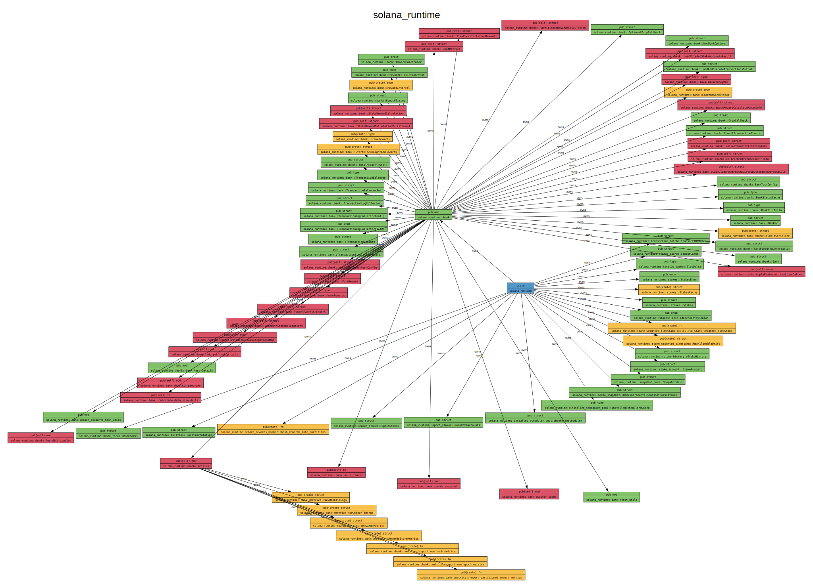

## Solana Runtime

Transaction execution is orchestrated via the `solana_runtime::bank`.

## Usages of Bank

### banks-server

_seems to be used for testing only_

[docs](https://docs.rs/solana-banks-server/latest/solana_banks_server/)

- used by program-test via test-validator

#### Bank Usage

- `BanksServer::run` -> `bank.try_process_entry_transactions`
- `bank.simulate_transaction_unchecked`
- `impl Banks for BanksServer`

### send-transaction-service

[docs](https://docs.rs/solana-send-transaction-service/latest/solana_send_transaction_service/)

- receives transactions from RPC clients
- sends + retries those transactions to `tpu_address` (via socket)
- used by `solana-banks-server`, `solana-rpc`, `solana-core` and `solana-validator`

#### Bank Usage

- seems only to use the bank in order to figure out how to _retry_ transactions which are then
  sent (i.e. not directly executed via the bank)
- `process_transactions` -> `working_bank.get_signature_status_slot`

### ledger

[docs](https://docs.rs/solana-ledger/latest/solana_ledger/)

- blockstore: _provides functions for parallel verification of the Proof of History ledger as well as
iterative read, append write, and random access read to a persistent file-based ledger._

#### Bank Usage

- `execute_batch` -> `batch.bank().load_execute_and_commit_transactions`
- multi-threaded execution of transactions (we ported this partly to `magicblock-processor`)

### unified-scheduler-pool

[docs](https://docs.rs/solana-unified-scheduler-pool/latest/solana_unified_scheduler_pool/)

> Transaction scheduling code.

> This crate implements 3 solana-runtime traits (`InstalledScheduler`, `UninstalledScheduler` and
> `InstalledSchedulerPool`) to provide a concrete transaction scheduling implementation
> (including executing txes and committing tx results).
>
> At the highest level, this crate takes `SanitizedTransaction`s via its `schedule_execution()`
> and commits any side-effects (i.e. on-chain state changes) into the associated `Bank` via
> `solana-ledger`'s helper function called `execute_batch()`.

#### Bank Usage

- prevents conflicting tx executions via locking `TaskHandler::handle` -> `bank.prepare_unlocked_batch_from_single_tx`
- calls into `execute_batch` of the blockstore processor

### core

[docs](https://docs.rs/solana-core/latest/solana_core/)

> The **fetch_stage** batches input from a UDP socket and sends it to a channel.

> The **sigverify_stage** implements the signature verification stage of the TPU. It receives a
> list of lists of packets and outputs the same list, but tags each top-level list with a
> list of booleans, telling the next stage whether the signature in that packet is valid. It
> assumes each packet contains one transaction. All processing is done on the CPU by default
> and on a GPU if perf-libs are available

> The **banking_stage** processes Transaction messages. It is intended to be used to construct a
> software pipeline. The stage uses all available CPU cores and can do its processing in
> parallel with signature verification on the GPU.

#### Bank Usage

- `banking_stage.consumer` uses it to process transactions
- `process_transactions` -> `process_and_record_transactions` -> [ `bank.check_transactions`, `process_and_record_transactions_with_pre_results` ]
- `process_and_record_transactions_with_pre_results` -> `bank.prepare_sanitized_batch_with_results`
- `execute_and_commit_transactions_locked` -> [ `bank.collect_balances`, `bank.load_and_execute_transactions` ]

### poh

[docs](https://docs.rs/solana-poh/latest/solana_poh/)

- mainly used to sync with bank slot info
- does not process transactions via the bank
- poh_recorder: _The poh_recorder module provides an object for synchronizing with Proof of History. It synchronizes PoH, bank’s register_tick and the ledger_
- poh_service: _The poh_service module implements a service that records the passing of “ticks”, a measure of time in the PoH stream_

### gossip

[docs](https://docs.rs/solana-gossip/latest/solana_gossip/)

- does not process transactions via the bank
- `cluster_info.rs` gets stake + feature info from bank to gossip to other validators

### validator

- seems to only use it in tests

