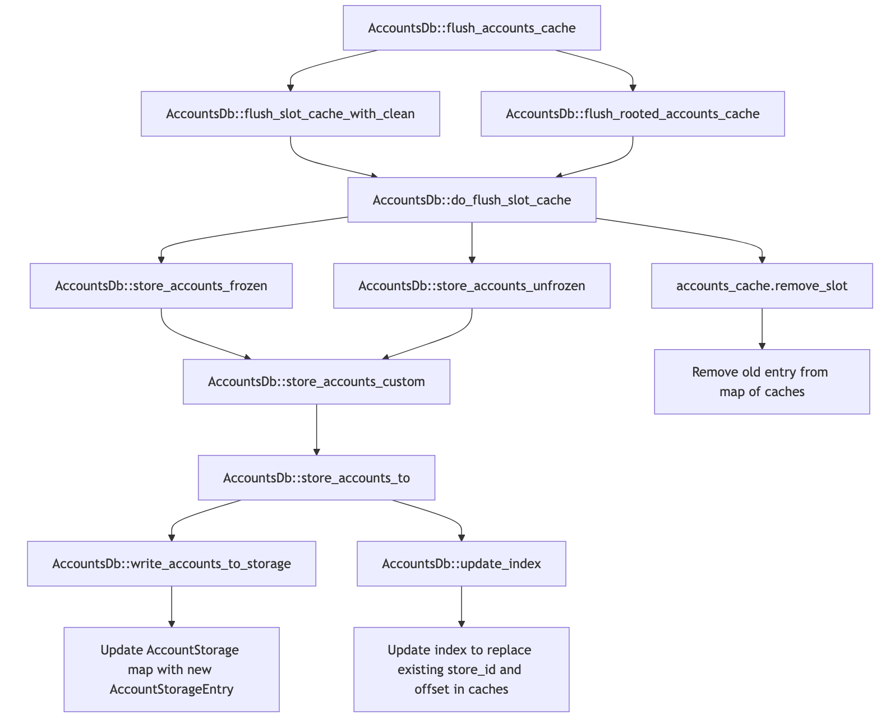

## AccountsDB

### Persistence

#### AccountStorage

Provides mapping of `AccountStorageEntry`s by slot.

Exposed on the `AccountsDb` as `pub storage: AccountStorage` in Solana.
In our case we wrapped this inside the `AccountsPersister`.

It supports some _shrink_ process running which is why it maintains two maps.
When querying `map` is checked before `shrink_in_progress_map`.

A `store_id` needs to be provided when looking up an entry.
It is matched against the `id` of the `AccountStorageEntry` in either map to return
a valid match.

It seems like most of the complexity comes from the _shrink in process_ feature, otherwise
it could just a simple map.


```rs
pub struct AccountStorage {
    /// map from Slot -> the single append vec for the slot
    map: AccountStorageMap,
    /// while shrink is operating on a slot, there can be 2 append vecs active for that slot
    /// Once the index has been updated to only refer to the new append vec, the single entry for the slot in 'map' can be updated.
    /// Entries in 'shrink_in_progress_map' can be found by 'get_account_storage_entry'
    shrink_in_progress_map: DashMap<Slot, Arc<AccountStorageEntry>>,
}

pub type AccountStorageMap = DashMap<Slot, AccountStorageReference>;
pub struct AccountStorageReference {
    /// the single storage for a given slot
    pub storage: Arc<AccountStorageEntry>,
    /// id can be read from 'storage', but it is an atomic read.
    /// id will never change while a storage is held, so we store it separately here for faster runtime lookup in 'get_account_storage_entry'
    pub id: AppendVecId,
}
```

**Find an `AccountStorageEntry` by slot and store_id**

```rs
pub(crate) fn get_account_storage_entry(
    &self,
    slot: Slot,
    store_id: AppendVecId,
) -> Option<Arc<AccountStorageEntry>>
```

**Insert an `AccountStorageEntry` into the `AccountStorage`**

Only available while no _shrink_ is in process.

```rs
fn insert(&self, slot: Slot, store: Arc<AccountStorageEntry>)
```

Extends the `map` with the entry.

#### AccountStorageEntry

Persistent storage structure holding the accounts.

```rs
#[derive(Debug)]
pub struct AccountStorageEntry {
    pub(crate) id: AtomicAppendVecId,

    pub(crate) slot: AtomicU64,

    /// storage holding the accounts
    pub accounts: AccountsFile,

    /// Keeps track of the number of accounts stored in a specific AppendVec.
    /// This is periodically checked to reuse the stores that do not have
    /// any accounts in it
    /// Lets us know that the append_vec, once maxed out, then emptied,
    /// can be reclaimed
    count_and_status: SeqLock<(usize, AccountStorageStatus)>,

    /// This is the total number of accounts stored ever since initialized to keep
    /// track of lifetime count of all store operations. And this differs from
    /// count_and_status in that this field won't be decremented.
    ///
    /// This is used as a rough estimate for slot shrinking. As such a relaxed
    /// use case, this value ARE NOT strictly synchronized with count_and_status!
    approx_store_count: AtomicUsize,
    [ .. ]
}
```

#### AccountsFile/AppendVec

A thread-safe, file-backed block of memory used to store `Account` instances.
Append operations are serialized such that only one thread updates the internal
`append_lock` at a time.
No restrictions are placed on reading, i.e we can read items from one thread while another is
appending new items.


```rs
#[derive(Debug, AbiExample)]
pub struct AppendVec {
    /// The file path where the data is stored.
    path: PathBuf,

    /// A file-backed block of memory that is used to store the data for each appended item.
    map: MmapMut,

    /// A lock used to serialize append operations.
    append_lock: Mutex<()>,

    /// The number of bytes used to store items, not the number of items.
    current_len: AtomicUsize,

    /// The number of bytes available for storing items.
    file_size: u64,
}
```

Exposed as an enum variant of `AccountsFile` in `AccountStorageEntry`

```rs
pub enum AccountsFile {
    AppendVec(AppendVec),
}
```

Has a `fn flush(&self)` which flushes the underlying `MmapMut` to disk.


### Store Accounts Flow

#### Isolated for storing accounts to disk

```
AccountsDb::flush_accounts_cache
└── AccountsDb::do_flush_slot_cache
    └── AccountsDb::store_accounts_frozen
      └── AccountsDb::store_accounts_custom
        └── AccountsDb::store_accounts_to
          └── AccountsDb::write_accounts_to_storage
```

#### Full Store Accounts Flow

<summary><b>Graph</b></summary>

<details>

</details>

<summary><b>ASCII</b></summary>

<details>
<pre><code>
AccountsDb::flush_accounts_cache
├── AccountsDb::flush_slot_cache_with_clean
│   └── AccountsDb::do_flush_slot_cache
│       ├── AccountsDb::store_accounts_frozen
│       │   └── AccountsDb::store_accounts_custom
│       │       └── AccountsDb::store_accounts_to
│       │           ├── AccountsDb::write_accounts_to_storage
│       │           │   └── Update AccountStorage map with new AccountStorageEntry
│       │           └── AccountsDb::update_index
│       │               └── Update index to replace existing store_id and offset in caches
│       ├── AccountsDb::store_accounts_unfrozen
│       │   └── AccountsDb::store_accounts_custom
│       │       └── AccountsDb::store_accounts_to
│       │           ├── AccountsDb::write_accounts_to_storage
│       │           │   └── Update AccountStorage map with new AccountStorageEntry
│       │           └── AccountsDb::update_index
│       │               └── Update index to replace existing store_id and offset in caches
│       └── accounts_cache.remove_slot
│           └── Remove old entry from map of caches
└── AccountsDb::flush_rooted_accounts_cache
    └── AccountsDb::do_flush_slot_cache
        ├── AccountsDb::store_accounts_frozen
        │   └── AccountsDb::store_accounts_custom
        │       └── AccountsDb::store_accounts_to
        │           ├── AccountsDb::write_accounts_to_storage
        │           │   └── Update AccountStorage map with new AccountStorageEntry
        │           └── AccountsDb::update_index
        │               └── Update index to replace existing store_id and offset in caches
        ├── AccountsDb::store_accounts_unfrozen
        │   └── AccountsDb::store_accounts_custom
        │       └── AccountsDb::store_accounts_to
        │           ├── AccountsDb::write_accounts_to_storage
        │           │   └── Update AccountStorage map with new AccountStorageEntry
        │           └── AccountsDb::update_index
        │               └── Update index to replace existing store_id and offset in caches
        └── accounts_cache.remove_slot
            └── Remove old entry from map of caches
```
</code></pre>
</details>

### `flush_accounts_cache` entry points

- there are very many, from tests and benches either direct or indirect, i.e. via
`AccountsDb::flush_root_write_cache`
- `Bank::flush_accounts_cache_is_needed` and `Bank::force_flush_accounts_cache` are the two
  only prod locations

### `flush_slot_cache_with_clean` entry points

- `AccountsDb::flush_slot_cache` via `AccountsDb::flush_accounts_cache`
- `AccountsDb::flush_rooted_accounts_cache` via `AccountsDb::flush_accounts_cache`

### `do_flush_slot_cache` entry points

- `AccountsDb::flush_slot_cache_with_clean` flushes a subset of accounts determined by `should_flush_f`
  and `max_clean_root` via a call to `do_flush_slot_cache`
- if `should_flush_f` is not provided it flushes all accounts

#### `store_accounts_unfrozen` entry points

- `AccountsDb::store` wraps `store_accounts_unfrozen` collecting performance metrics and stats
- following up the call stack we found that the variant using `StoreTo::Storage` is **only used
  for tests**

**`store` entry points** showing that:

- `AccountsDb::store_cached` +  `AccountsDb::store_cached_inline_update_index`(not interesting to us here)
- `AccountsDb::store_uncached` only called by tests

```rs
fn store<'a, T: ReadableAccount + Sync + ZeroLamport + 'a>(
    &self,
    accounts: impl StorableAccounts<'a, T>,
    store_to: &StoreTo,
    transactions: Option<&'a [Option<&'a SanitizedTransaction>]>,
    reclaim: StoreReclaims,
    update_index_thread_selection: UpdateIndexThreadSelection)
```

#### `store_accounts_frozen` entry points

`do_flush_slot_cache` retrieves + prepares accounts _cached_ for a particular slot. Part of the
preparation is determining a hash for each account.

Removes outdated accounts from the _cache_.

Then creates a `AccountStorageEntry` for the slot, inserts it into the `AccountStorage` and
provides that to `store_accounts_frozen`.

```rs
fn do_flush_slot_cache(
    &self,
    slot: Slot,
    slot_cache: &SlotCache,
    mut should_flush_f: Option<&mut impl FnMut(&Pubkey, &AccountSharedData) -> bool>,
    max_clean_root: Option<Slot>)
```

**Other entry points**

- `AccountsDb::do_shrink_slot_store` which shrinks accounts of slots that are no longer in the
  accounts cache
- `AccountsDb::write_ancient_accounts` writes and _shrinks_ ancient accounts
- `CurrentAncientAppendVec::store_ancient_accounts`
- runtime `SnapshotMinimzier::filter_storage` creates new storage replacing `storages` that contains
  only accounts in `minimized_account_set`

#### `store_accounts_custom` entry points

Both of the below call `store_accounts_custom`.

- _store_accounts_unfrozen_: invokes with `reset_accounts: true`

```rs
fn store_accounts_unfrozen<'a, T: ReadableAccount + Sync + ZeroLamport + 'a>(
    &self,
    accounts: impl StorableAccounts<'a, T>,
    hashes: Option<Vec<impl Borrow<AccountHash>>>,
    store_to: &StoreTo,
    transactions: Option<&'a [Option<&'a SanitizedTransaction>]>,
    reclaim: StoreReclaims,
    update_index_thread_selection: UpdateIndexThreadSelection,
)
```

- _store_accounts_frozen_: invokes with `reset_accounts: false` and `StoreTo::Storage(storage)`
  meaning this _always_ writes to _disk storage_ and the `AccountStorageEntry` is provided as
  an argument directly

```rs
fn store_accounts_frozen<'a, T: ReadableAccount + Sync + ZeroLamport + 'a>(
    &self,
    accounts: impl StorableAccounts<'a, T>,
    hashes: Option<Vec<impl Borrow<AccountHash>>>,
    storage: &Arc<AccountStorageEntry>,
    write_version_producer: Option<Box<dyn Iterator<Item = StoredMetaWriteVersion>>>,
    reclaim: StoreReclaims,
) -> StoreAccountsTiming
```

The below prepares the following and aside from calling into `store_accounts_to`:

- initializes a `write_version_producer` unless it was provided
- measures operation overhead
- handles _reclaims_

```rs
fn store_accounts_custom(
    accounts: impl StorableAccounts<'a, T>,
    hashes: Option<Vec<impl Borrow<AccountHash>>>,
    write_version_producer: Option<Box<dyn Iterator<Item = u64>>>,
    store_to: &StoreTo,
    reset_accounts: bool,
    transactions: Option<&[Option<&SanitizedTransaction>]>,
    reclaim: StoreReclaims,
    update_index_thread_selection: UpdateIndexThreadSelection,
) -> StoreAccountsTiming
```

The below supports two storage options and only calls `write_accounts_to_storage` if
`store_to` is `StoreTo::Storage(storage)`.

```rs
fn store_accounts_to(
    accounts: &'c impl StorableAccounts<'b, T>,
    hashes: Option<Vec<impl Borrow<AccountHash>>>,
    mut write_version_producer: P,
    store_to: &StoreTo,
    transactions: Option<&[Option<&'a SanitizedTransaction>]>) {
  // calls
  self.write_accounts_to_storage()
  // in variouse variations mostly depending on hashes are derived
}
```

```rs
fn write_accounts_to_storage(
    _: Slot,
    _: AccountStorageEntry,
    _: StorableAccountsWithHashesAndWriteVersions)
```

#### Flushing

| Flusher                                                 | Accessed data source for cached/stored
| ------------------------------------------------------- |----------------------------------|
| 01 flush_slot_cache()                                   | N/A
| 02 store_accounts_frozen()/write_accounts_to_storage()  | map of stores (creates new entry)
| 03 store_accounts_frozen()/update_index()               | index
|                                                         | (replaces existing store_id, offset in caches)
| 04 accounts_cache.remove_slot()                         | map of caches (removes old entry)
